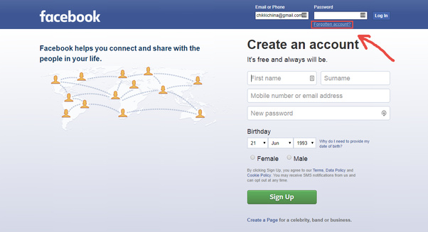

# DH-Final-Art-Project
The website is meant to be a satirical approach to show users who brows the web and social media what is going on behind the scenes. It was modeled off of this image.

***The website is not optimised for mobile devices and devices with smaller screens. If your screen size is too small, the webpage may not render perfectly. This is purely a visual problem and will not affect functionality explained in the features.** 

# How to access page

## Remote
you can access the website by going to http://ec2-3-129-148-71.us-east-2.compute.amazonaws.com/dh-final-project/

## Local

if you want to download and access the site locally on your own computer the follow the following steps.

 1. Clone the git repository onto your local machine
 2. Open the index.html file on the web browser of choice.

# Features

## Loading 
When the webpage is first loaded, the user sees a loading screen which informs the user that ads a data collectors are being loaded before the actual website content. This is the same way that most websites load but do it much faster.

## Pop up ads
Every 20 seconds an ad is randomly picked from 10 predefined ads and displayed on a random position on the screen. The ads cover any functionality that was previously displayed making the browsing experience infuriating toward the user.

## Data/ Cookie Policy
After the website had loaded up, the user is prompted to either accept or decline the data and cookie policy. When the user clicks the decline button, the page will load for 10 seconds and then inform the user that an error has occured and to pick the other option. When the accept button is clicked, the prompt goes away like normal.

## Birthday Question
When the user clicks the question for why they need to enter their birthday, an ad pops up covering the question. This makes it so that the link cannot be clicked and the question will not be answered.

## Opt out checkbox
When the user attempts to click the opt out checkbox, the checkbox will move if the mouse gets too close to it. This makes it so that it is impossible for the user to check the box and opt out.

## Sign up
When the user clicks the sign up button, the user is then prompted that their account has been created and their data is being sent to undisclosed companies. The page then redirects the user to the real Facebook page.